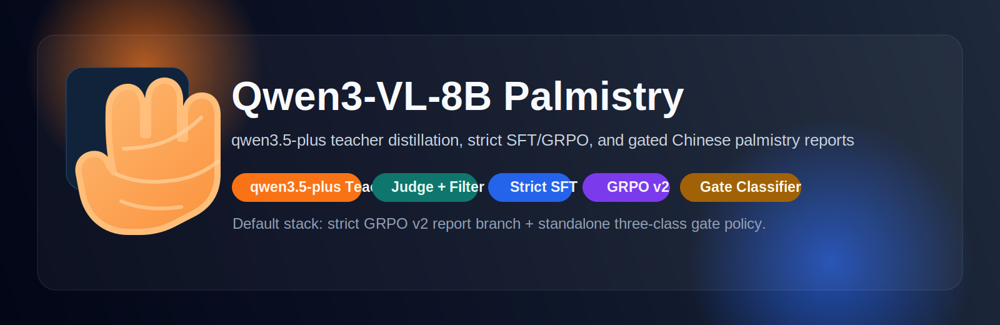

<p align="center">
  
</p>

<h1 align="center">Qwen3-VL Palmistry LoRA</h1>

<p align="center">
  A GitHub-ready palmistry fine-tuning project built on top of Qwen-VL-Series-Finetune.
</p>

<p align="center">
  
  
  
  
  
</p>

## 中文简介

这是一个基于 `Qwen3-VL` 的手相图像 LoRA 微调项目。其训练流程包括：

- 用 GPT-5 生成手相结构化标注作为 teacher 数据
- 用 `Qwen3-VL` 作为 student 模型
- 用 LoRA SFT 学习“读取手部图片并输出掌纹分析”
- 在推理阶段再通过 prompt，把结构化理解展开成自然中文手相报告

该仓库保留了上游 `Qwen-VL-Series-Finetune` 的通用训练内核，同时将 palmistry 任务相关的数据、训练、推理与展示层整理为独立模块，适合公开发布与持续迭代。

## 当前最佳结果

- 数据清洗后，从 `19587` 条原始样本中筛出 `3942` 条 `clean` 样本用于 teacher 生成
- 使用 `qwen3.5-plus` 自动生成 `3899` 条可用结构化 palmistry teacher 数据
- 按原图簇切分得到 `3509` 条训练样本和 `390` 条验证样本，避免增强图泄漏
- 基于 `Qwen3-VL-8B-Instruct` 完成 `3 epochs` LoRA SFT，最终 `train_loss = 0.5444`
- 经分层门控校准后，`val` 集 `structured_available_rate = 0.96`，`full_report_rate = 0.44`
- `hard_cases` 集 `low_confidence_rate = 0.80`，`full_report_rate = 0.0`，说明困难样本已能以谨慎分析或重拍提示为主

## English Overview

This repository adapts the upstream `Qwen-VL-Series-Finetune` framework into a palmistry-focused multimodal fine-tuning project.

The current pipeline is:

- GPT-5 generated palmistry annotations as teacher data
- `Qwen3-VL` as the student model
- LoRA SFT for image-conditioned palm-line understanding
- Prompt-based report generation for final natural Chinese responses

## Why This Repo

- Clear separation between upstream training core and palmistry-specific application code
- GitHub-safe structure with datasets, checkpoints, logs, and local symlinks excluded from version control
- Reusable CLI and Gradio entrypoints for demo and deployment
- Config-driven training wrapper instead of machine-specific hardcoded shell scripts
- Documentation that explains what is actually being learned by the LoRA

## Experiment Notes

- Iteration summary: [docs/experiment_iterations.md](docs/experiment_iterations.md)
- Report GRPO v2 analysis: [docs/report_grpo_v2_analysis.md](docs/report_grpo_v2_analysis.md)
- Uncertainty honesty optimization plan: [docs/uncertainty_honesty_plan.md](docs/uncertainty_honesty_plan.md)
- Architecture notes: [docs/architecture.md](docs/architecture.md)
- Distillation + GRPO notes: [docs/distillation_and_grpo.md](docs/distillation_and_grpo.md)

## Project Snapshot

```text
GPT-5 palmistry labels
        ↓
LLaVA-style hand-image dataset
        ↓
src/train/train_sft.py
        ↓
Qwen3-VL + LoRA adapters
        ↓
Palmistry inference pipeline
        ↓
CLI / Gradio Chinese report generation
```

## Extended Workflow

This repository now supports two complementary stages beyond basic SFT:

1. Automated teacher-data distillation  
   Call a large multimodal model through an OpenAI-compatible API, validate the returned palmistry JSON, and write the result directly into a LLaVA-style SFT dataset.

2. GRPO post-training  
   Start from a base model or an existing SFT LoRA adapter, then optimize with palmistry-specific reward functions. The repo now supports both structured-JSON GRPO and report-style GRPO.

## What Is Actually In Here

- Core SFT trainer: [src/train/train_sft.py](src/train/train_sft.py)
- Palmistry training wrapper: [scripts/palmistry/train_lora.sh](scripts/palmistry/train_lora.sh)
- Palmistry prompts: [src/palmistry/prompts.py](src/palmistry/prompts.py)
- Palmistry schema + teacher pipeline: [src/palmistry/schema.py](src/palmistry/schema.py), [src/palmistry/teacher.py](src/palmistry/teacher.py)
- Palmistry GRPO rewards: [src/palmistry/reward_funcs_structured.py](src/palmistry/reward_funcs_structured.py), [src/palmistry/reward_funcs_report.py](src/palmistry/reward_funcs_report.py)
- Palmistry inference pipeline: [src/palmistry/pipeline.py](src/palmistry/pipeline.py)
- Standalone gate classifier runtime: [src/palmistry/gate_classifier_runtime.py](src/palmistry/gate_classifier_runtime.py)
- CLI inference: [tools/infer_palmistry.py](tools/infer_palmistry.py)
- Teacher data generation CLI: [tools/generate_teacher_dataset.py](tools/generate_teacher_dataset.py)
- Report GRPO dataset builder: [tools/build_report_grpo_dataset.py](tools/build_report_grpo_dataset.py)
- Gate classifier trainer: [tools/train_gate_classifier.py](tools/train_gate_classifier.py)
- Gradio demo: [apps/gradio_palmistry.py](apps/gradio_palmistry.py)
- Adapter export tool: [tools/export_peft_adapter.py](tools/export_peft_adapter.py)
- Experiment iteration summary: [docs/experiment_iterations.md](docs/experiment_iterations.md)
- Report GRPO v2 analysis: [docs/report_grpo_v2_analysis.md](docs/report_grpo_v2_analysis.md)
- Uncertainty honesty optimization plan: [docs/uncertainty_honesty_plan.md](docs/uncertainty_honesty_plan.md)
- Gate classifier training notes: [docs/gate_classifier_training.md](docs/gate_classifier_training.md)
- Gate classifier vs generative gate: [docs/gate_classifier_vs_generative_gate.md](docs/gate_classifier_vs_generative_gate.md)
- Architecture notes: [docs/architecture.md](docs/architecture.md)
- Distillation + GRPO notes: [docs/distillation_and_grpo.md](docs/distillation_and_grpo.md)
- Dataset notes: [data/README.md](data/README.md)

## Repository Layout

```text
.
├── apps/
│   └── gradio_palmistry.py
├── configs/
│   └── palmistry/
│       ├── grpo.env.example
│       ├── grpo_report.env.example
│       ├── inference.env.example
│       ├── report_grpo_data.env.example
│       ├── teacher_generation.env.example
│       ├── train_gate_classifier.env.example
│       └── train_lora.env.example
├── data/
│   ├── README.md
│   └── examples/
├── docs/
│   ├── experiment_iterations.md
│   ├── report_grpo_v2_analysis.md
│   ├── uncertainty_honesty_plan.md
│   ├── architecture.md
│   └── assets/
├── scripts/
│   ├── palmistry/
│   └── zero*.json
├── src/
│   ├── palmistry/
│   └── train/
└── tools/
```

## Training Framework

The training backbone remains the upstream multimodal SFT stack. The palmistry layer mainly standardizes:

- model path
- dataset path
- image folder path
- LoRA settings
- DeepSpeed launch config
- inference prompt style

One important project-specific detail:

- the current `data/palmistry_llava.json` labels are mainly GPT-5 generated structured JSON strings
- so the LoRA is learning visual palm-line interpretation and structured analysis first
- the final long-form natural Chinese report style can then be improved further with the report-oriented GRPO stage

That means this repo is best understood as:

- a hand-image understanding LoRA
- plus a palmistry report generation layer that can be shaped by prompts and report GRPO

## Quick Start

### 1. Install

```bash
pip install -r requirements.txt -f https://download.pytorch.org/whl/cu128
pip install qwen-vl-utils
pip install flash-attn --no-build-isolation
```

Or:

```bash
conda env create -f environment.yaml
conda activate train
pip install qwen-vl-utils
pip install flash-attn --no-build-isolation
```

### 2. Configure Training

```bash
cp configs/palmistry/train_lora.env.example configs/palmistry/train_lora.env
```

On AutoDL, the palm-image root now defaults to `/root/autodl-tmp/data/Palmistry.v2i.coco`.

Then edit:

- `BASE_MODEL_PATH`
- `PALMISTRY_DATA_ROOT`
- `DATA_PATH`
- `EVAL_PATH`
- `OUTPUT_DIR`

### 3. Launch LoRA Training

```bash
bash scripts/palmistry/train_lora.sh configs/palmistry/train_lora.env
```

### 3.5. Generate Teacher Distillation Data

```bash
cp configs/palmistry/teacher_generation.env.example configs/palmistry/teacher_generation.env
bash scripts/palmistry/generate_teacher_data.sh configs/palmistry/teacher_generation.env
```

By default, the teacher pipeline reads from `/root/autodl-tmp/data/Palmistry.v2i.coco/manifests/teacher_all.jsonl` and resolves images under `/root/autodl-tmp/data/Palmistry.v2i.coco`.

The teacher API is OpenAI-compatible. For DashScope, Qwen3.5 multimodal models fit this workflow, while the actual API `model` value can be `qwen-plus` or `qwen-vl-plus`.
Set `TEACHER_NUM_WORKERS` in the env file to enable concurrent API requests when the provider quota allows it.

The teacher pipeline now also supports an optional `teacher -> judge -> filter` stage.
If `JUDGE_MODEL` is set, each generated teacher JSON is reviewed against the image and labeled as `accept`, `accept_cautious`, or `reject` before being exported into the final SFT dataset.

### 3.55. Split SFT Data Into Train / Val

```bash
python -m tools.split_sft_dataset \
  --input-json ./artifacts/palmistry_llava.generated.clean.qwen3_5_plus.json \
  --output-train-json ./artifacts/palmistry_llava.generated.clean.qwen3_5_plus.train.json \
  --output-val-json ./artifacts/palmistry_llava.generated.clean.qwen3_5_plus.val.json \
  --output-summary ./artifacts/palmistry_llava.generated.clean.qwen3_5_plus.split_summary.json \
  --val-ratio 0.1 \
  --seed 42
```

The splitter keeps augmented variants from the same source palm image in the same split, avoiding train/val leakage.

The palmistry LoRA wrapper supports both `DATA_PATH` and `EVAL_PATH`, so the validation split can be evaluated directly during training.

Main entrypoints:

- [tools/generate_teacher_dataset.py](tools/generate_teacher_dataset.py)
- [tools/split_sft_dataset.py](tools/split_sft_dataset.py)
- [tools/build_gate_policy_dataset.py](tools/build_gate_policy_dataset.py)
- [scripts/palmistry/generate_teacher_data.sh](scripts/palmistry/generate_teacher_data.sh)
- [docs/distillation_and_grpo.md](docs/distillation_and_grpo.md)

### 3.6. Prepare Report-Style GRPO Data

```bash
cp configs/palmistry/report_grpo_data.env.example configs/palmistry/report_grpo_data.env
bash scripts/palmistry/prepare_report_grpo_dataset.sh configs/palmistry/report_grpo_data.env
```

This converts the structured teacher dataset into a GRPO dataset whose prompt asks for a natural Chinese report, while keeping the original structured JSON as the reward reference.

### 3.65. Build A Three-Class Gate-Policy Dataset

```bash
python -m tools.build_gate_policy_dataset \
  --structured-json ./artifacts/palmistry_llava.generated.clean.qwen3_5_plus.json \
  --hard-manifest /root/autodl-tmp/data/Palmistry.v2i.coco/manifests/teacher_train.hard_cases.jsonl \
  --output-jsonl ./artifacts/palmistry_gate_policy.jsonl \
  --output-summary ./artifacts/palmistry_gate_policy.summary.json
```

The current inference stack now uses an independent three-class gate policy:

- `continue`: normal analysis
- `cautious`: conservative structured-only analysis
- `retake`: suggest the user reshoot the image

### 4. Run CLI Inference

```bash
python -m tools.infer_palmistry \
  --base-model /path/to/Qwen3-VL-8B-Instruct \
  --lora-path ./output/palmistry_lora_qwen3_vl_8b \
  --gate-classifier-path ./output/palmistry_gate_classifier_efficientnet_b0_v1/best.pt \
  --image /path/to/hand.png \
  --style balanced
```

If `--gate-classifier-path` is set, the runtime uses the standalone three-class gate classifier first and only falls back to the old generative gate if the classifier path is missing or inference fails.
The standalone classifier also applies conservative confidence thresholds by default, so borderline `continue` or `retake` predictions are downgraded to `cautious` instead of forcing an unstable decision.

### 5. Run Gradio Demo

```bash
python -m apps.gradio_palmistry \
  --base-model /path/to/Qwen3-VL-8B-Instruct \
  --lora-path ./output/palmistry_lora_qwen3_vl_8b \
  --gate-classifier-path ./output/palmistry_gate_classifier_efficientnet_b0_v1/best.pt
```

## GRPO Reinforcement Learning

The repository now supports palmistry-specific GRPO training with configurable reward modules.

Recommended usage:

```bash
cp configs/palmistry/grpo.env.example configs/palmistry/grpo.env
bash scripts/palmistry/train_grpo.sh configs/palmistry/grpo.env
```

The GRPO wrappers also default `IMAGE_FOLDER` to `/root/autodl-tmp/data/Palmistry.v2i.coco` so the full dataset stays on the local AutoDL disk rather than the slower `/autodl-fs` mount.

For a second report-oriented GRPO stage:

```bash
cp configs/palmistry/grpo_report.env.example configs/palmistry/grpo_report.env
bash scripts/palmistry/train_grpo_report.sh configs/palmistry/grpo_report.env
```

Key points:

- `reward_funcs_module` is now configurable
- `src.palmistry.reward_funcs_structured` provides structured palmistry rewards
- `src.palmistry.reward_funcs_report` optimizes the final natural-language Chinese report
- `lora_weight_path` can be used to initialize GRPO from an existing SFT LoRA adapter
- a practical order is SFT -> structured GRPO -> report GRPO

## Data Format

The training data follows a LLaVA-style single-image conversation format:

- `image`: relative image filename
- `conversations[0]`: user prompt containing `<image>`
- `conversations[1]`: assistant target string

Tracked example:

- [data/examples/palmistry_llava.sample.json](data/examples/palmistry_llava.sample.json)

Data notes:

- Real hand images are not included in this public repo
- Full GPT-5 annotation files are not included either
- Local testing symlinks, checkpoints, and private assets are ignored by git

## Public Repository Safety

This repository intentionally does not track:

- `data/images/`
- `data/palmistry_llava.json`
- `data/test_palmdata.json`
- `output/`
- `scripts/train_log/`
- `ssh.txt`
- local test symlinks under `data/`

See [.gitignore](.gitignore) for the current public-safe rules.

## Notes On Scope

This project is for research, experimentation, and creative interaction design. Palmistry outputs are not medical, legal, or factual diagnoses.

If you want stronger final prose quality, the next obvious upgrade is a second-stage SFT dataset where the target outputs are already polished natural-language reports instead of structured JSON.

## Acknowledgements

- Upstream base project: `2U1/Qwen-VL-Series-Finetune`
- Multimodal model family: `Qwen3-VL`

## License

This repository keeps the upstream Apache 2.0 license.
